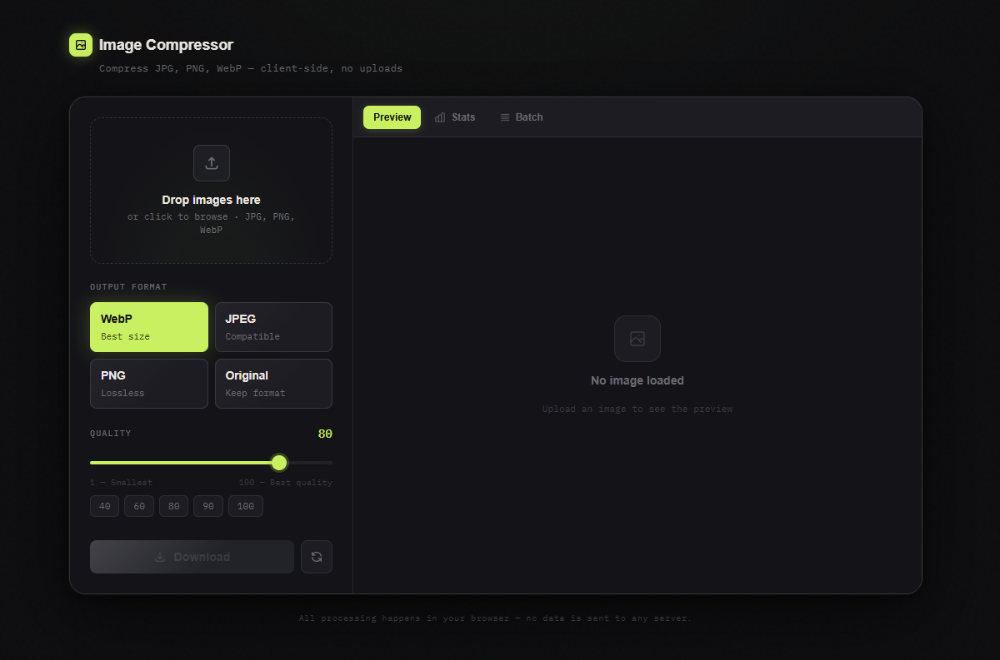

# 🖼️ Image Optimizer (React + Vite)

[](https://react.dev/)
[](https://vitejs.dev/)
[](https://www.typescriptlang.org/)
[](https://tailwindcss.com/)
[](LICENSE)

---

## 📌 Project Description

**Image Optimizer** is a modern, client-side image compression and conversion tool built with **React, Vite, and Tailwind CSS**.

It allows users to compress, convert, and preview images instantly in the browser — with **no uploads, no backend, and no external APIs**.

Supports **JPG, PNG, and WebP** formats with real-time preview and batch processing.

---

## ⚡ Features

- 🖼️ Image compression in the browser (Canvas API)
- 🔄 Format conversion (JPG, PNG, WebP)
- 👀 Live before/after preview slider
- 📦 Batch image processing
- 🎚️ Adjustable quality control
- 📉 File size comparison & savings stats
- ⚡ Fully client-side (no uploads)
- 📱 Responsive UI with Tailwind CSS

---

## 📸 Screenshot

<p align="center">
  
</p>

---

## 🧠 How It Works

1. User selects or drags an image
2. Image is loaded using `FileReader`
3. Canvas API resizes & compresses the image
4. Output is converted to selected format
5. Result is displayed instantly (no server involved)

---

## 🚀 Getting Started

### 📁 Clone the repository

```bash
git clone https://github.com/wilfredo-domanico-jr/Image-Optimizer-React.git
cd Image-Optimizer-React
```

---

### 📦 Install dependencies

```bash
npm install
```

---

### ▶️ Run development server

```bash
npm run dev
```

---

### 🏗️ Build for production

```bash
npm run build
```

---

### 👀 Preview production build

```bash
npm run preview
```

---

## 🧰 Tech Stack

- React 19
- Vite
- TypeScript
- Tailwind CSS
- Canvas API (for image processing)
- FileReader API
- Blob / URL APIs

---

## 📂 Project Structure

```
Image-Optimizer-React/
├── src/
│   ├── components/
│   ├── hooks/
│   ├── utils/
│   ├── App.tsx
│   └── main.tsx
├── public/
├── index.html
└── vite.config.ts
```

---

## 📈 Use Cases

- Optimize images for websites
- Reduce file size before uploading to CMS
- Convert images to WebP for performance
- Batch compress images for projects
- Portfolio / frontend tool demonstration

---

## 📄 License

This project is licensed under the [MIT License](LICENSE).

---

## ⭐ Acknowledgements

Built with modern web technologies for fast, private, and efficient image optimization directly in the browser.
